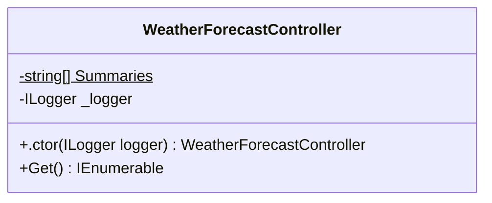
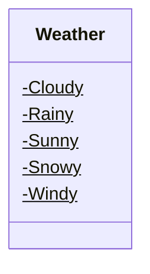
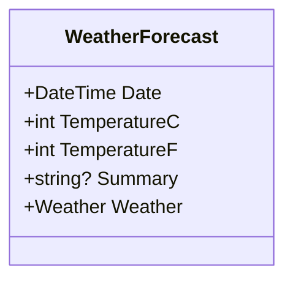

<!-- markdownlint-capture -->
<!-- markdownlint-disable -->

# Code Metrics

This file is dynamically maintained by a bot, *please do not* edit this by hand. It represents various [code metrics](https://aka.ms/dotnet/code-metrics), such as cyclomatic complexity, maintainability index, and so on.

## CSharkGithubActions :heavy_check_mark:

The *CSharkGithubActions.csproj* project file contains:

- 3 namespaces.
- 4 named types.
- 77 total lines of source code.
- Approximately 33 lines of executable code.
- The highest cyclomatic complexity is 2 :heavy_check_mark:.

  <strong id="global+namespace">
    &lt;global namespace&gt; :heavy_check_mark:
  </strong>

 

The `<global namespace>` namespace contains 1 named types.

- 1 named types.
- 25 total lines of source code.
- Approximately 24 lines of executable code.
- The highest cyclomatic complexity is 2 :heavy_check_mark:.

  <strong id="program$">
    &lt;Program&gt;$ :heavy_check_mark:
  </strong>

 

- The `<Program>$` contains 1 members.
- 25 total lines of source code.
- Approximately 24 lines of executable code.
- The highest cyclomatic complexity is 2 :heavy_check_mark:.

| Member kind | Line number | Maintainability index | Cyclomatic complexity | Depth of inheritance | Class coupling | Lines of source / executable code |
| :-: | :-: | :-: | :-: | :-: | :-: | :-: |
| Method | <a href='https://github.com/IanBuck-dev/CSharkGithubActions/blob/test-1/../../../../../github/workspace/Program.cs#L1' title='<top-level-statements-entry-point>'>1</a> | 66 | 2 :heavy_check_mark: | 0 | 1 | 25 / 12 |

<a href="#global+namespace">:top: back to &lt;global namespace&gt;</a>

  <strong id="csharkgithubactions-controllers">
    CSharkGithubActions.Controllers :heavy_check_mark:
  </strong>

 

The `CSharkGithubActions.Controllers` namespace contains 1 named types.

- 1 named types.
- 31 total lines of source code.
- Approximately 7 lines of executable code.
- The highest cyclomatic complexity is 1 :heavy_check_mark:.

  <strong id="weatherforecastcontroller">
    WeatherForecastController :heavy_check_mark:
  </strong>

 

- The `WeatherForecastController` contains 4 members.
- 28 total lines of source code.
- Approximately 7 lines of executable code.
- The highest cyclomatic complexity is 1 :heavy_check_mark:.

| Member kind | Line number | Maintainability index | Cyclomatic complexity | Depth of inheritance | Class coupling | Lines of source / executable code |
| :-: | :-: | :-: | :-: | :-: | :-: | :-: |
| Field | <a href='https://github.com/IanBuck-dev/CSharkGithubActions/blob/test-1/../../../../../github/workspace/Controllers/WeatherForecastController.cs#L14' title='ILogger<WeatherForecastController> WeatherForecastController._logger'>14</a> | 100 | 0 :heavy_check_mark: | 0 | 1 | 1 / 0 |
| Method | <a href='https://github.com/IanBuck-dev/CSharkGithubActions/blob/test-1/../../../../../github/workspace/Controllers/WeatherForecastController.cs#L16' title='WeatherForecastController.WeatherForecastController(ILogger<WeatherForecastController> logger)'>16</a> | 96 | 1 :heavy_check_mark: | 0 | 1 | 4 / 1 |
| Method | <a href='https://github.com/IanBuck-dev/CSharkGithubActions/blob/test-1/../../../../../github/workspace/Controllers/WeatherForecastController.cs#L22' title='IEnumerable<WeatherForecast> WeatherForecastController.Get()'>22</a> | 76 | 1 :heavy_check_mark: | 0 | 6 | 11 / 3 |
| Field | <a href='https://github.com/IanBuck-dev/CSharkGithubActions/blob/test-1/../../../../../github/workspace/Controllers/WeatherForecastController.cs#L9' title='string[] WeatherForecastController.Summaries'>9</a> | 82 | 0 :heavy_check_mark: | 0 | 0 | 3 / 1 |

<a href="#WeatherForecastController-class-diagram">:link: to `WeatherForecastController` class diagram</a>

<a href="#csharkgithubactions-controllers">:top: back to CSharkGithubActions.Controllers</a>

  <strong id="csharkgithubactions">
    CSharkGithubActions :heavy_check_mark:
  </strong>

 

The `CSharkGithubActions` namespace contains 2 named types.

- 2 named types.
- 21 total lines of source code.
- Approximately 2 lines of executable code.
- The highest cyclomatic complexity is 2 :heavy_check_mark:.

  <strong id="weather">
    Weather :heavy_check_mark:
  </strong>

 

- The `Weather` contains 5 members.
- 8 total lines of source code.
- Approximately 0 lines of executable code.
- The highest cyclomatic complexity is 0 :heavy_check_mark:.

| Member kind | Line number | Maintainability index | Cyclomatic complexity | Depth of inheritance | Class coupling | Lines of source / executable code |
| :-: | :-: | :-: | :-: | :-: | :-: | :-: |
| Field | <a href='https://github.com/IanBuck-dev/CSharkGithubActions/blob/test-1/../../../../../github/workspace/WeatherForecast.cs#L17' title='Weather.Cloudy'>17</a> | 100 | 0 :heavy_check_mark: | 0 | 0 | 1 / 0 |
| Field | <a href='https://github.com/IanBuck-dev/CSharkGithubActions/blob/test-1/../../../../../github/workspace/WeatherForecast.cs#L18' title='Weather.Rainy'>18</a> | 100 | 0 :heavy_check_mark: | 0 | 0 | 1 / 0 |
| Field | <a href='https://github.com/IanBuck-dev/CSharkGithubActions/blob/test-1/../../../../../github/workspace/WeatherForecast.cs#L20' title='Weather.Snowy'>20</a> | 100 | 0 :heavy_check_mark: | 0 | 0 | 1 / 0 |
| Field | <a href='https://github.com/IanBuck-dev/CSharkGithubActions/blob/test-1/../../../../../github/workspace/WeatherForecast.cs#L19' title='Weather.Sunny'>19</a> | 100 | 0 :heavy_check_mark: | 0 | 0 | 1 / 0 |
| Field | <a href='https://github.com/IanBuck-dev/CSharkGithubActions/blob/test-1/../../../../../github/workspace/WeatherForecast.cs#L21' title='Weather.Windy'>21</a> | 100 | 0 :heavy_check_mark: | 0 | 0 | 1 / 0 |

<a href="#Weather-class-diagram">:link: to `Weather` class diagram</a>

<a href="#csharkgithubactions">:top: back to CSharkGithubActions</a>

  <strong id="weatherforecast">
    WeatherForecast :heavy_check_mark:
  </strong>

 

- The `WeatherForecast` contains 5 members.
- 11 total lines of source code.
- Approximately 2 lines of executable code.
- The highest cyclomatic complexity is 2 :heavy_check_mark:.

| Member kind | Line number | Maintainability index | Cyclomatic complexity | Depth of inheritance | Class coupling | Lines of source / executable code |
| :-: | :-: | :-: | :-: | :-: | :-: | :-: |
| Property | <a href='https://github.com/IanBuck-dev/CSharkGithubActions/blob/test-1/../../../../../github/workspace/WeatherForecast.cs#L5' title='DateTime WeatherForecast.Date'>5</a> | 100 | 2 :heavy_check_mark: | 0 | 1 | 1 / 0 |
| Property | <a href='https://github.com/IanBuck-dev/CSharkGithubActions/blob/test-1/../../../../../github/workspace/WeatherForecast.cs#L11' title='string? WeatherForecast.Summary'>11</a> | 100 | 2 :heavy_check_mark: | 0 | 1 | 1 / 0 |
| Property | <a href='https://github.com/IanBuck-dev/CSharkGithubActions/blob/test-1/../../../../../github/workspace/WeatherForecast.cs#L7' title='int WeatherForecast.TemperatureC'>7</a> | 100 | 2 :heavy_check_mark: | 0 | 0 | 1 / 0 |
| Property | <a href='https://github.com/IanBuck-dev/CSharkGithubActions/blob/test-1/../../../../../github/workspace/WeatherForecast.cs#L9' title='int WeatherForecast.TemperatureF'>9</a> | 91 | 2 :heavy_check_mark: | 0 | 1 | 1 / 2 |
| Property | <a href='https://github.com/IanBuck-dev/CSharkGithubActions/blob/test-1/../../../../../github/workspace/WeatherForecast.cs#L12' title='Weather WeatherForecast.Weather'>12</a> | 100 | 2 :heavy_check_mark: | 0 | 1 | 1 / 0 |

<a href="#WeatherForecast-class-diagram">:link: to `WeatherForecast` class diagram</a>

<a href="#csharkgithubactions">:top: back to CSharkGithubActions</a>

<a href="#csharkgithubactions">:top: back to CSharkGithubActions</a>

## Metric definitions

  - **Maintainability index**: Measures ease of code maintenance. Higher values are better.
  - **Cyclomatic complexity**: Measures the number of branches. Lower values are better.
  - **Depth of inheritance**: Measures length of object inheritance hierarchy. Lower values are better.
  - **Class coupling**: Measures the number of classes that are referenced. Lower values are better.
  - **Lines of source code**: Exact number of lines of source code. Lower values are better.
  - **Lines of executable code**: Approximates the lines of executable code. Lower values are better.

## Mermaid class diagrams

##### `WeatherForecastController` class diagram

##### `Weather` class diagram

##### `WeatherForecast` class diagram

*This file is maintained by a bot.*

<!-- markdownlint-restore -->
